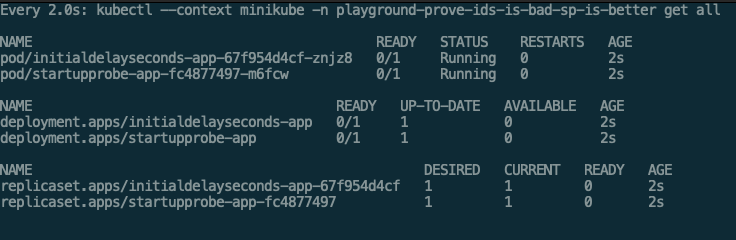
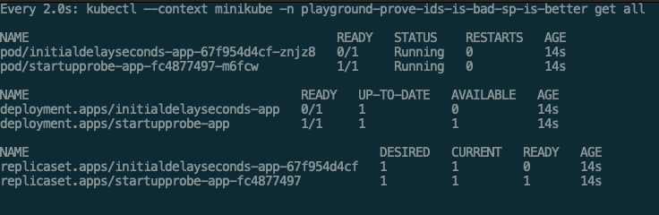

# playground-prove-initialdelayseconds-is-bad-startupprobe-is-better

## Why `readinessProbe.initialDelaySeconds` is bad

`readinessProbe.initialDelaySeconds` is bad beacuse it gave its startup time some fixed time to be ready.
The startup time depends on any external environments like the spec of the machine, application state, ....

The startup time should be dynamic, flexible and short as much as possible.

## Better alternative

Use `startupProbe`. This will give you a flexibility for this topic.
By its `failureThreshold` and `periodSeconds`, you can replace a fixed time until pod to be ready.

## Proof

**Just start-up**

**startupProbe one is ready**

**initialDelaySeconds one is finally ready**

